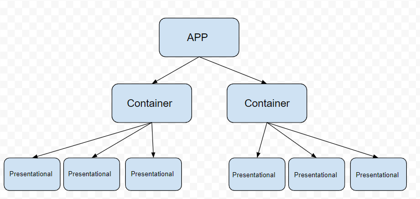

# 355SDEV_Intro_to_React

### Objective:

Utilize Vite to build a basic React application.

## Learning Goals

- Organize a React project using a proper folder structure.
- Use JSX to build and render a basic "Hello World" component.
- Create and render multiple pages/components, such as "About Me", "Projects", and "Contact".
- Understand and apply basic React concepts, including components and JSX syntax.

### Helpful Resources

- [Writing Markup with JSX](https://react.dev/learn/writing-markup-with-jsx)
- [Your First Component](https://react.dev/learn/your-first-component)
- [Importing and Exporting Components](https://react.dev/learn/importing-and-exporting-components)

### React

React is a JavaScript library that lets us build frontend applications using a component-based architecture, enabling clean and efficient single-page application (SPA) development.

### Vite

[Vite documentation](https://vite.dev/guide/)
While we can build React applications from scratch, it’s generally recommended to use a React framework or build tool that provides a blueprint for a starter application.

One of the most recommended frameworks is Next.js, which we’ll use later in the quarter for its many features and powerful functionality.

For now, we’ll start with Vite—a lightweight build tool that lets us spin up React applications quickly.

### Imperative vs Declarative Programming

React uses **declarative programming** instead of what you’ve been using so far: **imperative programming**.

Imagine **imperative programming** as giving your system a step-by-step list of instructions, explaining exactly _how_ to complete a task.

With **declarative programming**, we can be a bit more abstract. We describe _what_ we want done, without listing out every single step of _how_ to do it.

### Example

**Imperative:**

- Retrieve bread
- Retrieve peanut butter
- Place on cutting board
- Open bread and take two slices, place on cutting board
- Open peanut butter
- Retrieve knife
- Scoop peanut butter with knife and spread on one piece of bread

**Declarative:**

- Make a sandwich

### JXS

JSX is a syntax extension for JavaScript that lets us write HTML-like content directly inside JavaScript files. React takes that JSX and eventually translates it into real DOM elements.

JSX is returned from a special kind of function used by React called a **component**.

The component below renders a `<div>` containing an `<h1>` with the text **"Hello World"**.

All DOM manipulation is handled by React under the hood using something called the **Virtual DOM**, which we’ll cover in more detail in a later lesson.

// A component can be defined using the function keyword or an arrow function

```

function MyFirstComponent() {
  // JSX is returned inside a pair of parentheses, unless it fits on a single line.
  // The JSX must have a single outer tag that wraps all other elements.
  // This is similar to how the <body> tag wraps all HTML content on a page.
  return (
    //JSX tags are very similar to HTML tags.
    <div>
      <h1>Hello World</h1>
    </div>
  );
}

// Components are usually scoped to their own file and imported into other files for use.
export default MyFirstComponent;

```

## React Component hierarchy



React components render in the form of a **tree**, with the `App` component acting as the **root**.

The `App` component renders child components, which can either stand alone or render additional components of their own. Different components serve different purposes—some handle logic, while others focus on rendering UI.

Components are **reusable** and **modular**, meaning they can be moved around and reused in different parts of the application to build various features efficiently.

### Lab Deliverables

1. Create a React app using Vite

- Open your terminal and run `npm create vite@latest my-react-app`.
- Select **React** when prompted.
- Select **JavaScript** when prompted.
- Move into your new project directory with `cd my-react-app`.
- Install the dependencies by running `npm install`.
- Start the development server with `npm run dev`.
- Your application will be hosted on `http://localhost:5173/`, You will be able to view the progress of your application in the browser here.

2. Clear the Boilerplate

- Open the `my-react-app` folder in your code editor.
- Clear out everything in the `App.jsx` file so it looks like the example below.
- **Note:** The `<></>` tags are called _fragments_. They allow us to group JSX elements without adding extra HTML tags to the DOM. This helps avoid unwanted default styling or layout behavior.

```
function App() {
  return (
    <>
     <h1>Profile</h1>
    </>
  )
}

export default App

```

3. Create Components

- Create three new files in your project: `AboutMe.jsx`, `Projects.jsx`, and `Contact.jsx`.
- Each file should follow the same structure as the `App` component shown earlier, but replace the word **App** with the name of the file.

Below is an example for the `AboutMe.jsx` file:

```
function About() {
  return (
    <>

    </>
  )
}

export default About

```

4. Add JSX Content to Each Component

- In each component file (`AboutMe.jsx`, `Projects.jsx`, and `Contact.jsx`), add JSX that reflects what you'd include on a personal portfolio site.
- Think about what each individual HTML page would contain and structure your JSX accordingly.

Below is an example for the `AboutMe.jsx` component:

```
function About() {
  return (
    <div>
    <h2>Ixius Procopios</h2>
    <h3> Professor of Software Development </h3>
    <p> bio info here... </p>
    </div>
  )
}

export default About

```

5. Render Components

- `App` is a special component that acts as the root of our application and renders all other components.
- Import each of your components (`AboutMe`, `Projects`, and `Contact`) into `App.jsx`.
- To render a component, include it inside the `return` statement of the `App` component like an HTML tag (e.g., `<AboutMe />`).

- Below is an example on how to import the AboutMe component:

```
import AboutMe from "./AboutMe.jsx";

function App() {

  return (
    <>
     <h1>Profile</h1>
     <AboutMe />
    </>
  )
}

export default App

```

## Submission Instructions

1. Push your code to GitHub.
2. Submit the link to your GitHub repository URL.
